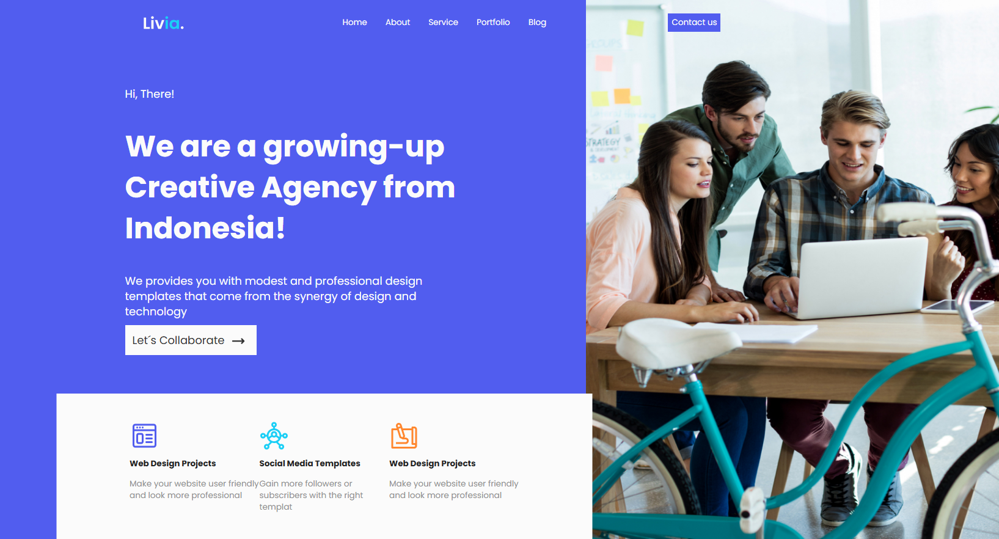
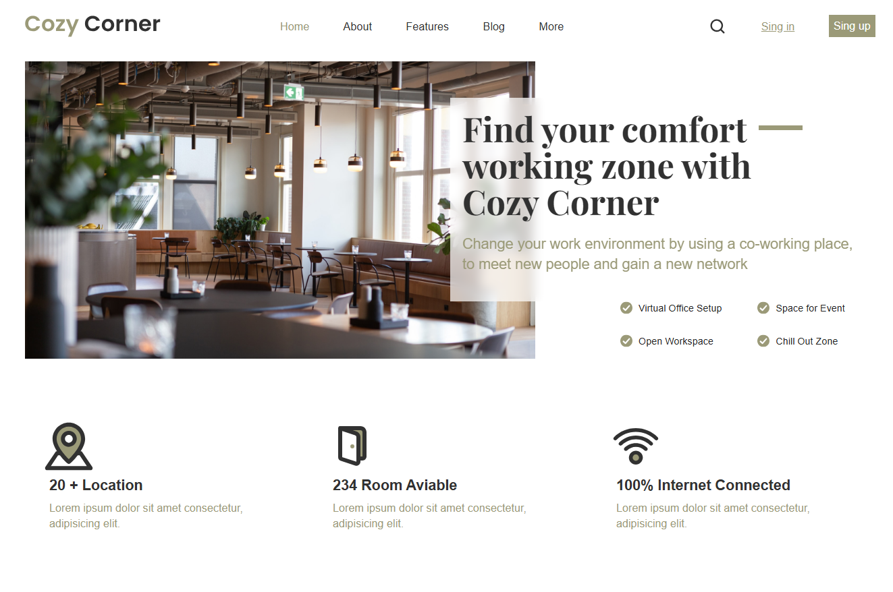
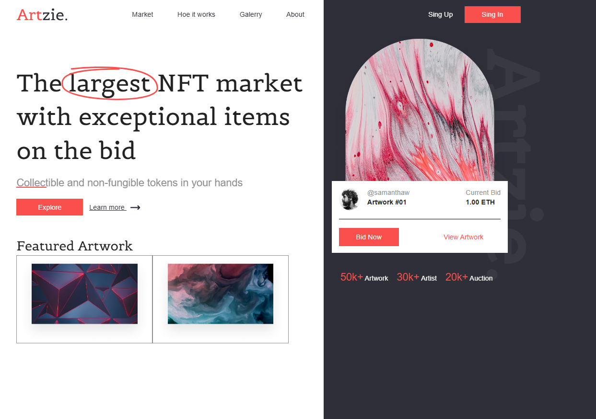
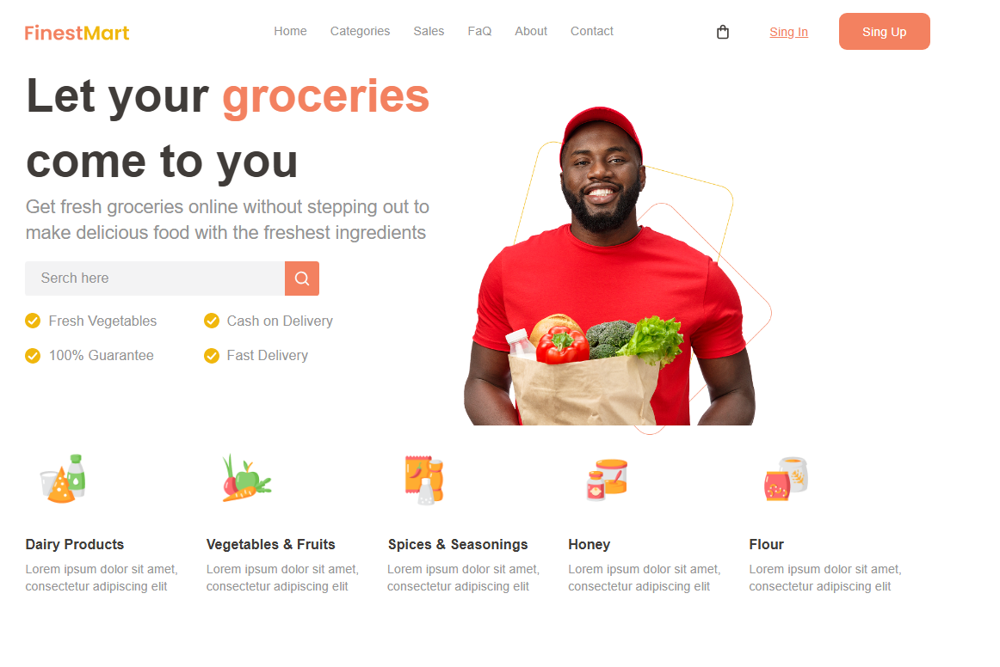

# 📚 Landing Pages - Prácticas de Clase

Este repositorio recoge una colección de tareas realizadas en clase, enfocadas en la práctica de maquetación web con **HTML** y **CSS (SCSS)**.  
Son **landing pages estáticas, no responsive**, desarrolladas con fines educativos.

No están desplegadas en GitHub Pages ya que se trata de múltiples proyectos separados. En su lugar, se incluyen **capturas de pantalla** para visualizar rápidamente cada diseño.

---

## 📂 Índice de proyectos

### 🔸 001 - Marketing Management
📁 Carpeta: `001-Marketing-code`  
🖼️ Vista previa:  

---

### 🔸 002 - Creative Agency
📁 Carpeta: `002-Creative-code`  
🖼️ Vista previa:  

---

### 🔸 003 - Coworking Center
📁 Carpeta: `003-Coworking-code`  
🖼️ Vista previa:  

---

### 🔸 004 - NFT Marketplace
📁 Carpeta: `004-Nft-code`  
🖼️ Vista previa:  

---

### 🔸 005 - Grocery Store
📁 Carpeta: `005-Grocery-code`  
🖼️ Vista previa:  

---

## 🛠️ Tecnologías usadas

- HTML5  
- CSS3 (SCSS)  
- Diseño no responsive  
- Sin frameworks ni JavaScript avanzado

---

## 📝 Notas

Estas páginas fueron creadas como ejercicios prácticos para afianzar conocimientos de estructura HTML, maquetación con CSS y organización de archivos.  
Cada proyecto está en su propia carpeta y contiene solo los archivos necesarios para su funcionamiento visual.
